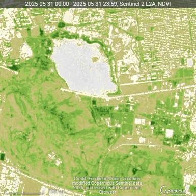
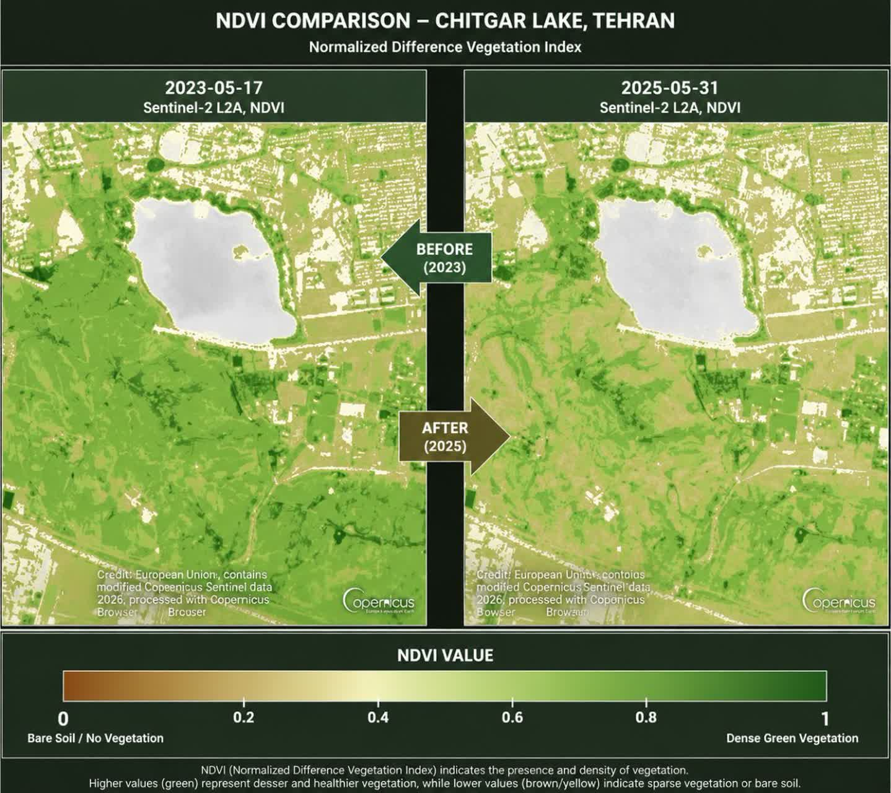
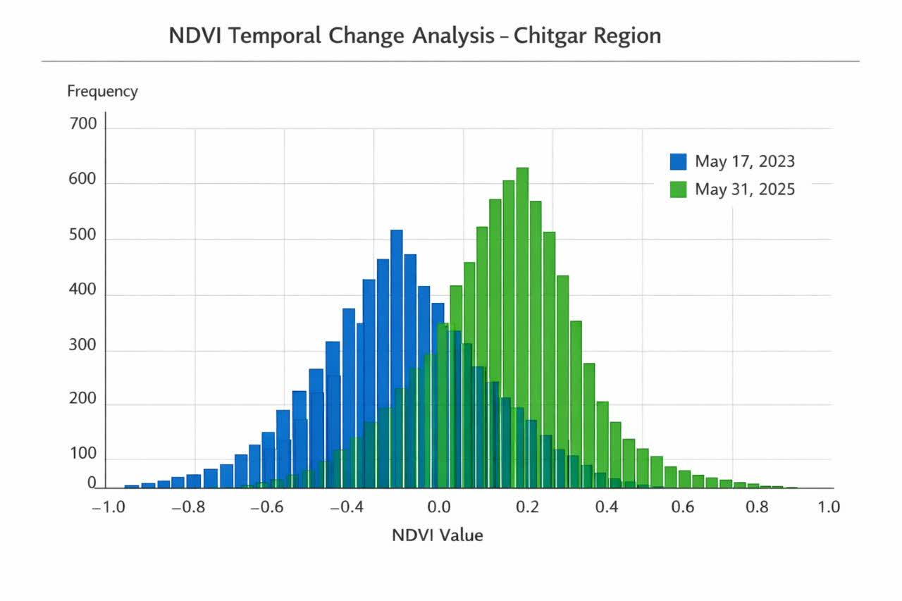

# NDVI-Stellite-Analysis
NDVI analysis of satellite imagery for vegetation monitoring - Aerospace Engineering Project
# Chitgar Lake NDVI Change Detection (2023-2025)

This project analyzes the Vegetation Index (NDVI) changes in the Chitgar Lake area, Tehran, using Sentinel-2 satellite imagery.

## 📌 Project Overview
The goal of this study is to monitor environmental changes and vegetation health over a two-year period (May 2023 to May 2025). The analysis includes NDVI calculation, histogram distribution comparison, and difference mapping.

### 📁 Structure 
- data/: Raw satellite snapshots from Copernicus Browser.
- outputs/maps/: Processed NDVI maps and Difference maps.
- outputs/charts/: Histogram distribution and comparison charts.

### 📊 Key Results
1. NDVI Comparison: Analysis shows a shift in vegetation density in the surrounding park areas.
2. Histogram Analysis: The 2025 data shows higher heterogeneity compared to 2023.
3. Difference Map: Highlights areas of growth (green) and areas of potential stress or construction (red/orange).

### 🛠 Tools Used 
- Copernicus Browser: Data sourcing (Sentinel-2 L2A).
- Python & GPT-5.5: Image processing, Histogram generation, and Statistical analysis.

## Technologies

- Python
- NumPy
- OpenCV
- Matplotlib
- Sentinel‑2 Satellite Imagery
- NDVI (Normalized Difference Vegetation Index)
---

## 🖼 Samples 

### NDVI Map (2025)

### Difference Map (2023 vs 2025)

### NDVI Histogram Distribution

---
Author: [Maede Nourshargh]
Date: June 2026
